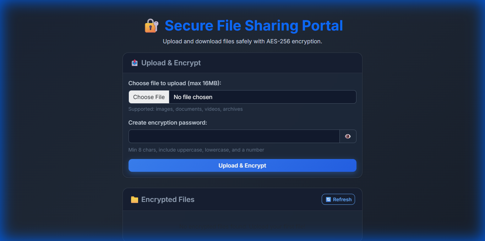
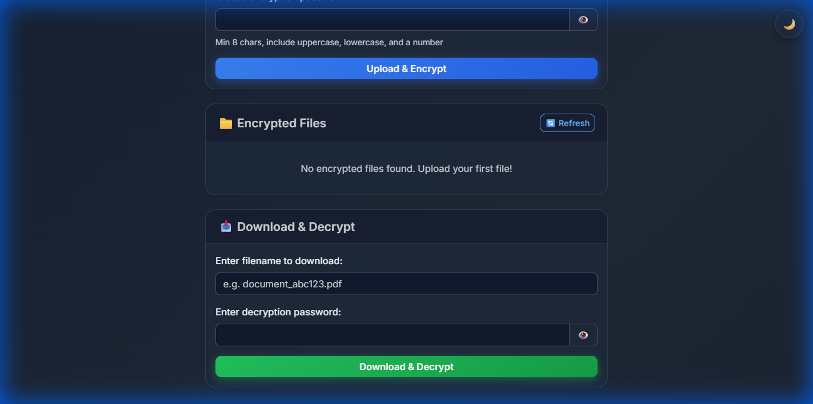

# 🔐 Secure File Share

A beautiful, secure file sharing application with AES-256 encryption. Upload files with password protection and share them safely.


## ✨ Features

### Core Security
- **🔒 AES-256 Encryption** - Military-grade encryption (AES-EAX mode) for your files
- **🔑 Password Protection** - PBKDF2 key derivation with 100,000 iterations
- **🛡️ Advanced Security Headers** - HSTS, CSP, X-Frame-Options, & X-Content-Type-Options
- **⚡ Strict Rate Limiting** - Prevents abuse (5 uploads/hr, 20 downloads/hr)

### File Management
- **📁 File Listing** - View all encrypted files with metadata
- **⏰ Auto-Expiration** - Files auto-delete after 7 days
- **📊 Download Counter** - Track how many times files are downloaded
- **🔗 Shareable Links** - Generate unique, secure share links

### User Experience
- **🎨 Modern Glassmorphism UI** - Beautiful dark/light mode with smooth animations
- **📁 Smart Drag & Drop** - Drop files anywhere with visual feedback
- **📱 Fully Responsive** - Optimized for desktop, tablet, and mobile
- **📊 Real-time Progress** - Upload progress bar and status feedback
- **📋 Auto-Copy** - Automatically copies share links to clipboard
- **💪 Password Strength** - Visual indicator for password complexity

## 🚀 Live Demo

**[🔗 Try it live on Render](https://secure-file-share.onrender.com)**

## 📸 Screenshots

### Main Interface
<p align="center">
  
</p>
<p align="center"><em>Modern dark-themed interface with drag & drop upload</em></p>

### File Management
<p align="center">
  
</p>
<p align="center"><em>Manage your encrypted files and download securely</em></p>


## 🛠️ Installation

### Prerequisites
- Python 3.10 or higher
- pip (Python package manager)

### Local Development

1. **Clone the repository**
   ```bash
   git clone https://github.com/Hao-Tec/secure-file-share.git
   cd secure-file-share
   ```

2. **Create virtual environment**
   ```bash
   python -m venv venv
   source venv/bin/activate  # On Windows: venv\Scripts\activate
   ```

3. **Install dependencies**
   ```bash
   pip install -r requirements.txt
   ```

4. **Set up environment variables**
   ```bash
   # Create a .env file (or rename .env.example)
   cp .env.example .env
   ```

5. **Run the application**
   ```bash
   python app.py
   ```

6. **Open in browser**
   ```
   http://127.0.0.1:5000
   ```

## 🔒 Security Architecture

| Feature | Description |
|---------|-------------|
| **Encryption** | AES-256 in EAX mode (Authenticated Encryption) |
| **Key Derivation** | PBKDF2-HMAC-SHA256 with 100,000 rounds and random salt |
| **Security Headers** | HSTS (Strict Transport Security), CSP (Content Security Policy), NoSniff, NoFrame |
| **Rate Limiting** | Per-IP limiting for uploads (2/min, 5/hr) and downloads (5/min, 20/hr) |
| **CSRF Protection** | Flask-WTF CSRF tokens on all forms |
| **Input Validation** | Secure filename sanitization and path traversal prevention |
| **IDOR Protection** | Deletion requires "proof of knowledge" (password verification) |

## 🚀 Deployment on Render

1. **Push to GitHub**
2. **Create Web Service** on Render
3. **Build Command:** `pip install -r requirements.txt`
4. **Start Command:** `gunicorn app:app`
5. **Environment Variables:**
   - `SECRET_KEY`: (Large random string)
   - `FLASK_ENV`: `production`

## 🤝 Contributing

Contributions are welcome! Please feel free to submit a Pull Request.

## 📄 License

This project is licensed under the MIT License - see the [LICENSE](LICENSE) file for details.

## 👨‍💻 Author

**The TECHMASTER** - [GitHub Profile](https://github.com/Hao-Tec)

---
<p align="center">
  Made with ❤️ and 🔐 security in mind
</p>
